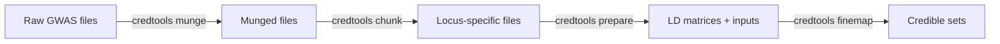

# Loci Identification and Chunking

The `credtools chunk` command identifies independent genetic loci from munged summary statistics and splits the data into locus-specific files ready for fine-mapping. This step defines the genomic regions that will be analyzed independently.

## Overview

After munging your summary statistics, you need to identify independent genetic signals and create focused datasets for fine-mapping. The chunking process:

- **Identifies independent loci** based on distance and significance thresholds
- **Merges overlapping regions** across different ancestries when appropriate
- **Creates locus-specific files** containing only variants within each region
- **Generates credtools-compatible** loci lists for downstream analysis
- **Handles multi-ancestry data** with consistent loci across populations

!!! note "Prerequisites"
    You must run `credtools munge` before chunking. The chunk command expects munged summary statistics files (`.munged.txt.gz`) as input. See the [Munge documentation](munge.md) for details.

## Quick Start

=== "Single File"

    ```bash
    credtools chunk EUR.munged.txt.gz output_dir/
    ```

=== "Multiple Files"

    ```bash
    credtools chunk "EUR.munged.txt.gz,AFR.munged.txt.gz,EAS.munged.txt.gz" output_dir/
    ```

=== "Population Config"

    ```bash
    credtools chunk population_config.txt output_dir/
    ```

### Try It with Test Data

credtools ships with example data so you can verify your installation immediately:

```bash
credtools chunk \
  exampledata/testout/munge/sumstat_info_updated.txt \
  /tmp/chunk_output/
```

!!! tip
    You can also pass comma-separated file paths directly instead of a config file:

    ```bash
    credtools chunk \
      "exampledata/testout/munge/EUR_cohort1.munged.txt.gz,exampledata/testout/munge/AFR_cohort1.munged.txt.gz,exampledata/testout/munge/EAS_cohort1.munged.txt.gz" \
      /tmp/chunk_output/
    ```

Expected output:

```
Loaded 3 population files from config
Identifying independent loci...
Processing ancestries: 100%|██████████| 3/3
Merging overlapping loci across ancestries
Chunking 5 loci...
Chunking loci: 100%|██████████| 5/5
Successfully processed 5 loci
Generated 15 chunked files
```

## Input Formats

### Option 1: Direct File Paths

Pass one or more munged file paths directly. Multiple files are separated by commas:

```bash
# Single file
credtools chunk EUR.munged.txt.gz output_dir/

# Multiple files (comma-separated, no spaces)
credtools chunk "EUR.munged.txt.gz,AFR.munged.txt.gz,EAS.munged.txt.gz" output_dir/
```

The file stem (e.g., `EUR_cohort1` from `EUR_cohort1.munged.txt.gz`) is used as the ancestry/cohort key.

### Option 2: Population Configuration File

For multi-ancestry studies, a tab-delimited configuration file provides richer metadata. This is the same format used by `credtools munge`:

| Column | Description |
|--------|-------------|
| `popu` | Population/ancestry label (e.g., EUR, AFR, EAS) |
| `cohort` | Cohort or study name |
| `sample_size` | Sample size for this population |
| `path` | Path to the munged summary statistics file |
| `ld_ref` | *(Optional)* Path to LD reference panel (PLINK prefix) |

**Example** `population_config.txt`:

```text
popu	cohort	sample_size	path	ld_ref
EUR	UKBB	400000	munged/EUR_UKBB.munged.txt.gz	/data/ref/EUR
AFR	AAGC	50000	munged/AFR_AAGC.munged.txt.gz	/data/ref/AFR
EAS	BBJ	180000	munged/EAS_BBJ.munged.txt.gz	/data/ref/EAS
```

!!! info
    This is the same TSV configuration format as the `credtools munge` output (`sumstat_info_updated.txt`). When an `ld_ref` column is present, the chunk command will also extract LD matrices automatically.

!!! warning
    The configuration file is **tab-delimited plain text**, not JSON. If your file has a `.json` extension or uses JSON syntax, it will not be parsed correctly.

## Command Reference

```
credtools chunk [OPTIONS] INPUT_CONFIG OUTPUT_DIR
```

**Arguments:**

| Argument | Description |
|----------|-------------|
| `INPUT_CONFIG` | Comma-separated munged file paths, or a population config file |
| `OUTPUT_DIR` | Output directory for chunked files |

**Options:**

| Option | Short | Description | Default |
|--------|-------|-------------|---------|
| `--distance` | `-d` | Distance threshold for independence (bp) | `500000` |
| `--pvalue` | `-p` | P-value threshold for significance | `5e-8` |
| `--merge-overlapping` | `-m` | Merge overlapping loci across ancestries | `True` |
| `--use-most-sig` | `-u` | Use most significant SNP if no significant SNPs | `True` |
| `--min-variants` | `-v` | Minimum variants per locus | `10` |
| `--custom-chunks` | `-cc` | Custom chunk file with chr, start, end columns | None |
| `--ld-format` | `-f` | LD computation format (`plink`/`vcf`) | `plink` |
| `--keep-intermediate` | `-k` | Keep intermediate files | `False` |
| `--threads` | `-t` | Number of threads | `1` |
| `--log-file` | `-l` | Log output to specified file | None |

## Algorithm Details

### Loci Identification Process

1. **Significance filtering**: Identify SNPs below the p-value threshold
2. **Distance-based clustering**: Group significant SNPs within the distance threshold
3. **Lead SNP selection**: Choose the most significant SNP in each cluster
4. **Region definition**: Create windows around lead SNPs (±distance/2)
5. **Overlap resolution**: Merge overlapping regions across ancestries if requested
6. **Quality filtering**: Remove loci with too few variants

### Multi-Ancestry Handling

When processing multiple ancestries:

- Each ancestry is processed independently first
- Overlapping loci across ancestries are merged into unified regions
- The most significant lead SNP across all ancestries is selected for merged loci
- Ancestry information is preserved in the output (comma-separated labels)

## Integration with Pipeline



```bash
# Step 1: Munge summary statistics
credtools munge population_config.txt munged/

# Step 2: Identify loci and create chunks
credtools chunk "munged/EUR_UKBB.munged.txt.gz,munged/AFR_AAGC.munged.txt.gz" chunks/

# Step 3: Prepare LD matrices
credtools prepare chunks/loci_list.txt genotype_config.json prepared/

# Step 4: Run fine-mapping
credtools finemap prepared/final_loci_list.txt results/
```

!!! info
    When your population config file includes an `ld_ref` column, `credtools chunk` automatically extracts LD matrices during the chunking step, combining the chunk and prepare stages into one command.

## Output Files

The chunk command produces the following directory structure:

```
output_dir/
├── identified_loci.txt          # Summary of all identified loci
├── loci_list.txt                # Credtools-compatible loci list for fine-mapping
├── sumstat_info_updated.txt     # Updated population config (when using config input)
├── chunks/
│   ├── chunk_info.txt           # Metadata about all chunk files
│   ├── EUR_UKBB.chr1_1000_2000.sumstats.gz
│   ├── AFR_AAGC.chr1_1000_2000.sumstats.gz
│   └── ...
└── prepared/                    # Only when ld_ref is provided
    ├── EUR_UKBB.chr1_1000_2000.ld.gz
    └── ...
```

### identified_loci.txt

| Column | Description |
|--------|-------------|
| `chr` | Chromosome number |
| `start` | Locus start position (bp) |
| `end` | Locus end position (bp) |
| `lead_snp` | Lead SNP identifier (chr-bp-allele1-allele2) |
| `lead_bp` | Lead SNP base pair position |
| `lead_p` | Lead SNP p-value |
| `ancestry` | Ancestry labels (comma-separated if merged) |
| `n_variants` | Number of variants in the locus |
| `locus_id` | Unique locus identifier (`chr{chr}_{start}_{end}`) |

### chunk_info.txt

| Column | Description |
|--------|-------------|
| `locus_id` | Unique locus identifier |
| `ancestry` | Ancestry/cohort key |
| `chr` | Chromosome number |
| `start` | Locus start position (bp) |
| `end` | Locus end position (bp) |
| `n_variants` | Number of variants in this chunk |
| `sumstats_file` | Path to the chunked sumstats file |

### loci_list.txt

| Column | Description |
|--------|-------------|
| `locus_id` | Unique locus identifier |
| `chr` | Chromosome number |
| `start` | Locus start position (bp) |
| `end` | Locus end position (bp) |
| `popu` | Population/ancestry code |
| `cohort` | Cohort identifier |
| `sample_size` | Sample size |
| `prefix` | File prefix for credtools downstream tools |

## Examples

### Example 1: Conservative Loci Definition

```bash
# Use stricter thresholds for fewer, more significant loci
credtools chunk munged/ output/ \
  --distance 1000000 \
  --pvalue 1e-8 \
  --min-variants 50
```

### Example 2: Liberal Loci Definition

```bash
# Use relaxed thresholds for more comprehensive coverage
credtools chunk munged/ output/ \
  --distance 250000 \
  --pvalue 1e-5 \
  --min-variants 5
```

### Example 3: Custom Genomic Regions

```bash
# Use pre-defined genomic regions instead of automatic identification
credtools chunk munged/ output/ \
  --custom-chunks custom_regions.txt
```

The custom chunk file should be tab-delimited with at minimum `chr`, `start`, and `end` columns:

```text
chr	start	end
1	1000000	2000000
2	5000000	6000000
```

### Example 4: With Logging and Intermediate Files

```bash
# Keep intermediate files and write detailed log
credtools chunk population_config.txt output/ \
  --keep-intermediate \
  --log-file chunk_run.log
```

## Parameter Guidelines

### Distance Threshold (`--distance`)

- **500kb (default)**: Balanced approach, suitable for most analyses
- **250kb**: More granular loci, better for dense association regions
- **1Mb**: Conservative approach, reduces computational burden
- **Consider LD patterns**: Use longer distances in populations with extended LD

### P-value Threshold (`--pvalue`)

- **5e-8 (default)**: Genome-wide significance threshold
- **1e-5**: Suggestive significance, more inclusive
- **1e-8**: Very stringent, fewer but highly significant loci
- **Population-specific**: Consider ancestry-specific significance levels

### Minimum Variants (`--min-variants`)

- **10 (default)**: Ensures reasonable LD computation
- **5**: More inclusive, useful for sparse regions
- **20–50**: Conservative, better for high-quality fine-mapping

## Troubleshooting

??? question "No loci identified"
    Lower the p-value threshold (`--pvalue 1e-5`) or enable `--use-most-sig` (enabled by default) to use the most significant SNP per chromosome even when nothing reaches genome-wide significance. Also verify that your munged files actually contain significant associations.

??? question "Too many small loci"
    Increase the distance threshold (`--distance 1000000`) or raise the minimum variant count (`--min-variants 50`). Small loci may not provide enough information for reliable fine-mapping.

??? question "Memory issues with large datasets"
    Use `--threads` to enable parallel processing and ensure sufficient RAM (typically 4–8 GB for genome-wide data). If memory is limited, consider processing ancestries individually before merging.

??? question "Inconsistent loci across ancestries"
    Ensure that all munged files use consistent chromosome and position encoding (same genome build). Enable `--merge-overlapping` (default) to unify overlapping loci from different ancestries into shared regions.

??? question "LD extraction fails"
    Check that the `ld_ref` column in your population config points to valid PLINK prefix paths (i.e., `.bed`, `.bim`, `.fam` files exist). Verify that the `--ld-format` matches your reference panel format (`plink` or `vcf`).

??? question "Custom chunks file not working"
    Ensure your custom chunk file is tab-delimited with at minimum `chr`, `start`, `end` columns. The chromosome column should use numeric values (1–22, not "chr1"). Check for trailing whitespace or encoding issues.

## Best Practices

!!! tip "Recommendations"
    1. **Start with defaults** — use default parameters initially, then optimize based on results
    2. **Use population config files** for multi-ancestry studies to preserve metadata and enable automatic LD extraction
    3. **Review identified loci** — check `identified_loci.txt` against known associations for your trait
    4. **Balance precision vs. coverage** — stricter thresholds give higher confidence but may miss signals
    5. **Use `--log-file`** for a detailed audit trail of all processing steps
    6. **Document parameters** — keep track of thresholds used for reproducibility
