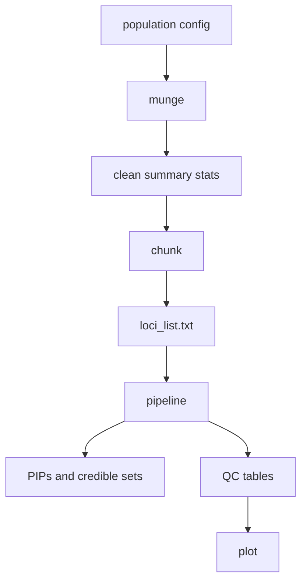

# Quickstart

This quickstart uses the small files in `exampledata/test_mock_data`. It starts
with raw summary statistics and PLINK reference files, then runs the CREDTOOLS
workflow.

Run the commands from the repository root.

## 1. Create a Population Config

The population config is a tab-separated file. Each row is one study or cohort.

```bash
cat > /tmp/credtools_population_config.tsv <<'EOF'
popu	cohort	sample_size	path	ld_ref
EUR	cohort1	10000	exampledata/test_mock_data/EUR_all_loci.sumstats	exampledata/test_mock_data/EUR_all_loci
AFR	cohort1	8000	exampledata/test_mock_data/AFR_all_loci.sumstats	exampledata/test_mock_data/AFR_all_loci
EAS	cohort1	12000	exampledata/test_mock_data/EAS_all_loci.sumstats	exampledata/test_mock_data/EAS_all_loci
EOF
```

The `ld_ref` column is a PLINK prefix. For example,
`exampledata/test_mock_data/EUR_all_loci` points to:

```text
exampledata/test_mock_data/EUR_all_loci.bed
exampledata/test_mock_data/EUR_all_loci.bim
exampledata/test_mock_data/EUR_all_loci.fam
```

## 2. Clean the Summary Statistics

```bash
credtools munge /tmp/credtools_population_config.tsv /tmp/credtools_munged --force
```

This creates standardized files and an updated config:

```text
/tmp/credtools_munged/
- EUR_cohort1.munged.txt.gz
- AFR_cohort1.munged.txt.gz
- EAS_cohort1.munged.txt.gz
- sumstat_info_updated.txt
```

## 3. Split the Data Into Loci

```bash
credtools chunk \
  /tmp/credtools_munged/sumstat_info_updated.txt \
  /tmp/credtools_chunks \
  --threads 2
```

This step identifies loci, cuts the summary statistics into locus-sized files,
and extracts LD matrices because `ld_ref` is present.

The most important file is:

```text
/tmp/credtools_chunks/loci_list.txt
```

## 4. Run the Pipeline

```bash
credtools pipeline \
  /tmp/credtools_chunks/loci_list.txt \
  /tmp/credtools_results \
  --tool susie \
  --meta-method meta_all
```

The pipeline runs meta-analysis, QC, and fine-mapping.

## 5. Check the Results

Look for these files:

```text
/tmp/credtools_results/
- pips.txt.gz
- causal_variants.txt.gz
- credible_sets_summary.txt.gz
- parameters.json
- run_summary.log
- kriging_rss.txt
- maf_comparison.txt
- snp_missingness.txt
```

Create a quick QC plot:

```bash
credtools plot \
  /tmp/credtools_results \
  --type summary \
  --output /tmp/credtools_results/qc_summary.png
```

## What You Just Did



## Next Step

If this worked, read [Raw GWAS to Results](../tutorials/from-raw-gwas-to-results.md)
for a slower walkthrough with more context. If you already have prepared locus
files, read [Existing Loci List](../tutorials/run-an-existing-loci-list.md).
