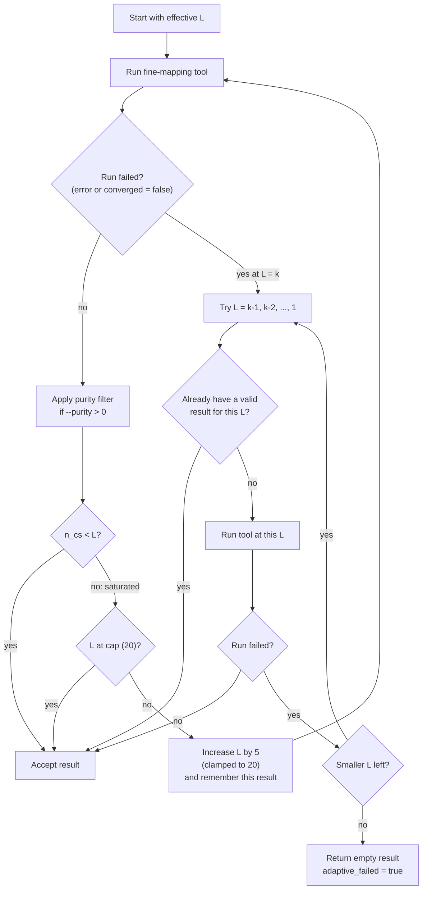

# Fine-Mapping Tool Requirements

Use this page when you are deciding whether a prepared locus has enough data for
a specific fine-mapping tool.

## Short Version

| Tool | Input mode | LD needed by method | Extra software | Notes |
| --- | --- | --- | --- | --- |
| `abf` | single input | no | none | ABF assumes one causal signal; CLI still expects LD files when loading from `loci_list.txt`. |
| `abf_cojo` | single input | yes | none | Uses COJO-style conditioning before ABF. |
| `susie` | single input | yes | none | Good default for most first-pass runs. |
| `susie_ash` | single input | yes | `Rscript`, `susieR >= 0.16.1` | SuSiE with adaptive-shrinkage background. |
| `susie_inf` | single input | yes | `Rscript`, `susieR >= 0.16.1` | SuSiE with infinitesimal background. |
| `finemap` | single input | yes | `finemap` executable | Requires `MAF`; has a per-locus timeout. |
| `rsparsepro` | single input | yes | none | Robust sparse model for LD mismatch sensitivity checks. |
| `carma` | single input | yes | `Rscript`, `CARMA` | Includes CARMA outlier modeling. |
| `multisusie` | multi input | yes | none | Joint multi-population SuSiE-style model. |
| `susiex` | multi input | yes | `SuSiEx` executable | Cross-ancestry fine-mapping wrapper. |
| `mesusie` | multi input | yes | `Rscript`, `MESuSiE` | Joint multi-ancestry model with shared and ancestry-specific signals. |

!!! note "Single input versus multi input"
    Single-input tools run once per row in a locus set and CREDTOOLS combines
    the results. Multi-input tools analyze all rows for the same `locus_id`
    together.

## Required Columns

All CLI fine-mapping workflows start from `loci_list.txt`:

```text
locus_id	chr	start	end	popu	cohort	sample_size	prefix
```

Each `prefix` should resolve to:

```text
{prefix}.sumstats.gz
{prefix}.ld.npz
{prefix}.ldmap.gz
```

The summary statistics should contain:

| Column | Used for |
| --- | --- |
| `SNPID` | matching summary statistics to LD |
| `CHR`, `BP` | location and plotting |
| `EA`, `NEA` | allele alignment |
| `EAF` | allele-frequency checks and derived `MAF` |
| `MAF` | required by FINEMAP; usually derived from `EAF` when loaded |
| `BETA`, `SE`, `P` | all fine-mapping models |
| `N` | useful in prepared files; CLI also uses `sample_size` from `loci_list.txt` |
| `RSID` | optional reporting field |

## No-Signal Behavior

Most single-input wrappers check `--significant-threshold` before running the
model. If no variant passes the threshold, CREDTOOLS returns an empty result
instead of forcing a weak credible set.

```bash
credtools finemap loci_list.txt results \
  --tool susie \
  --significant-threshold 5e-8
```

An empty result usually has:

- `n_cs = 0`
- `PIP = 0` for every variant
- no rows in `causal_variants.txt.gz`

If that is not what you want, loosen `--significant-threshold` for exploratory
runs and label the output accordingly.

## Convergence Options

Iterative tools expose `--max-iter` and convergence tolerance options. When a
fixed signal cap is hard to choose, use adaptive L.

## Adaptive L (`--adaptive-max-causal`) {#adaptive-l}

`L` is the model's cap on the number of causal signals. In the CREDTOOLS CLI,
this is exposed as `--max-causal`; in the Python API, it is the `max_causal`
argument. Adaptive L does not change the fine-mapping model itself. It is a
retry strategy around the selected tool that changes `max_causal` when the
current value looks too small or too hard for the model to fit.

Use it when loci have variable signal counts or when some high-L runs fail to
converge:

```bash
credtools pipeline loci_list.txt results \
  --tool susie \
  --max-causal 5 \
  --adaptive-max-causal
```

The starting value is the effective `max_causal`: the requested `--max-causal`,
or the COJO-derived value when `--set-L-by-cojo` is enabled.



The loop uses these rules:

| Situation | Adaptive action |
| --- | --- |
| Valid result with `n_cs < L` | Accept the result. This includes a genuine no-signal result with `n_cs = 0` and `converged = true` or unknown (for example, a significance-gated empty result). |
| Valid result with `n_cs >= L` | Treat the run as saturated. Remember this result, increase `L` by 5 (clamped to 20), and retry. A saturated result at `L = 20` is accepted as the best result within range. |
| The tool raises an error, or returns `converged = false` (at any `n_cs`) | Treat the run at `L = k` as failed and fall back to `k-1, k-2, ..., 1`. |
| Fallback reaches an `L` that already produced a valid result | Reuse that result directly without recomputation. |
| Fallback reaches an `L` that has not been tried | Run it; accept the first valid result. |
| Every attempted value fails or stays non-converged | Return an empty credible set with `parameters.adaptive_failed = true`. |

For example, with the default `L = 5`, a locus that saturates at 5 and 10 and
then fails at 15 falls back to 14. If 14 down to 11 also fail, the earlier
valid `L = 10` result is reused rather than restarting from `L = 4`. The
expansion phase never exceeds `L = 20`. If you need a strict scientific cap,
use a fixed `--max-causal` without adaptive L.

Each attempt is logged with its `max_causal`, the resulting `n_cs`, the
convergence flag, and the reason for any failure or fallback; the final line
reports the selected `max_causal`.

When `--adaptive-max-causal` is enabled, CREDTOOLS also defaults
`empty_on_nonconvergence=True` for wrappers that support it. This makes
non-converged runs return an empty result marked `converged = False`, so the
adaptive loop can keep reducing `L` instead of accepting unstable partial
credible sets.

Purity filtering is applied inside the adaptive loop when `--purity` is set.
That means the loop makes success and saturation decisions using the
post-filter `n_cs`, so low-purity credible sets do not force `L` upward.

Adaptive L applies to `finemap`, `rsparsepro`, `susie`, `susie_ash`, and
`susie_inf` per input locus. It applies to `multisusie`, `susiex`, and
`mesusie` once at the `LocusSet` level.

For SuSiEx, keep `--mult-step` off when using `--adaptive-max-causal`; both
features try to refine the model and can make debugging harder.

## Choosing the First Tool

Start with:

```bash
credtools pipeline loci_list.txt results \
  --tool susie \
  --meta-method meta_all \
  --max-causal 5
```

Then compare a smaller set of important loci with another tool:

```bash
credtools finemap important_loci.txt results_finemap \
  --tool finemap \
  --max-causal 5 \
  --timeout-minutes 30
```

Use comparison runs to answer a specific question, such as whether a top
credible set is stable under a different model.
