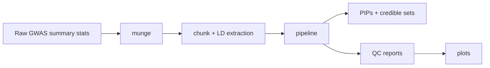

# CREDTOOLS

CREDTOOLS helps you go from GWAS summary statistics to fine-mapping results.
It handles the boring parts first: clean the files, split the genome into loci,
build matched LD inputs, run QC, and then run a fine-mapping tool.

If you are new, start with the path below. If you already have prepared locus
files, jump straight to the existing-loci tutorial.

<div class="grid cards" markdown>

-   **Start here**

    Learn the basic words CREDTOOLS uses, then run a small example.

    [:octicons-arrow-right-24: Getting Started](getting-started/index.md)

-   **Raw GWAS files**

    Begin with whole-genome summary statistics and PLINK reference panels.

    [:octicons-arrow-right-24: Raw GWAS to Results](tutorials/from-raw-gwas-to-results.md)

-   **Prepared loci**

    Already have `.sumstats`, `.ld`, and `.ldmap` files? Use this shorter route.

    [:octicons-arrow-right-24: Existing Loci List](tutorials/run-an-existing-loci-list.md)

-   **Command lookup**

    Need one flag or output detail? Use the CLI reference.

    [:octicons-arrow-right-24: CLI Reference](reference/cli/index.md)

</div>

## The Short Version



Most projects use this workflow:

```bash
credtools munge population_config.tsv work/munged --force
credtools chunk work/munged/sumstat_info_updated.txt work/chunks --threads 4
credtools pipeline work/chunks/loci_list.txt work/results --tool susie
credtools plot work/results/<locus_id> --type locusplot --output work/results/locus.png
```

!!! tip "Do not memorize the whole workflow yet"
    The docs are written so you can follow one page at a time. Start with the
    quickstart, then come back to the guide pages when you need to make choices.

## What CREDTOOLS Produces

The main outputs are easy to recognize:

- `pips.txt.gz`: one row per variant, with posterior inclusion probabilities.
- `credible_sets_summary.txt.gz`: one row per credible set.
- `causal_variants.txt.gz`: variants that belong to at least one credible set.
- QC tables such as `kriging_rss.txt`, `maf_comparison.txt`, and
  `snp_missingness.txt`.
- Optional plots from `credtools plot`.

## Where to Go Next

1. Read [Core Concepts](getting-started/concepts.md) if terms like LD, locus,
   PIP, or credible set are still fuzzy.
2. Run [Quickstart](getting-started/quickstart.md) to check your installation.
3. Use [Input Files](guides/input-files.md) when you are preparing your own data.
4. Read [Known Limitations](guides/known-limitations.md) before a large run.
5. Use [Choosing a Fine-Mapping Tool](guides/choosing-finemapping-tool.md) before
   running a large analysis.
6. Keep [File Schemas](reference/file-schemas.md) open when creating inputs by
   hand.
