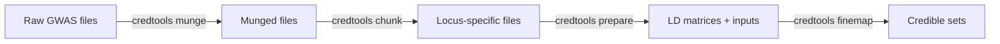

# Summary Statistics Munging

The `credtools munge` command standardizes GWAS summary statistics from various formats into a consistent format suitable for fine-mapping analysis. This preprocessing step ensures all input data follows a uniform schema before entering the fine-mapping pipeline.

## Overview

Different GWAS studies use different column names, data types, and conventions for their summary statistics. The munging process handles these inconsistencies automatically:

- **Standardizes column names** to the credtools schema (CHR, BP, EA, NEA, BETA, SE, P, etc.)
- **Validates and cleans data** — removes invalid variants (e.g., non-ACGT alleles, out-of-range p-values, zero standard errors)
- **Generates unique SNP identifiers** in `chr-bp-allele1-allele2` format
- **Supports multiple input formats** including tab/comma/space-delimited and gzip-compressed files
- **Handles multi-ancestry datasets** with consistent processing across populations

!!! note "Why munge first?"
    Fine-mapping tools are sensitive to data quality issues. Running `credtools munge` ensures your summary statistics are clean, consistently formatted, and free of common problems (duplicate variants, invalid alleles, numerical artifacts) before analysis.

## Quick Start

=== "Single File"

    ```bash
    credtools munge gwas_results.txt output_dir/
    ```

=== "Multiple Files"

    ```bash
    credtools munge "eur_gwas.txt,afr_gwas.txt,eas_gwas.txt" output_dir/
    ```

=== "Population Config"

    ```bash
    credtools munge population_config.txt output_dir/
    ```

### Try It with Test Data

credtools ships with example data so you can verify your installation immediately:

```bash
credtools munge \
  "exampledata/test_mock_data/EUR_all_loci.sumstats,exampledata/test_mock_data/AFR_all_loci.sumstats,exampledata/test_mock_data/EAS_all_loci.sumstats" \
  /tmp/munge_output/ \
  --force
```

Expected output:

```
Munging summary statistics...
Loaded 3 input file(s) from direct paths
Munging files: 100%|██████████| 3/3 [00:02<00:00,  1.06it/s]
Successfully munged 3 files
  ✓ EUR_all_loci: 10000 variants -> /tmp/munge_output/EUR_all_loci.munged.txt.gz
  ✓ AFR_all_loci: 10000 variants -> /tmp/munge_output/AFR_all_loci.munged.txt.gz
  ✓ EAS_all_loci: 10000 variants -> /tmp/munge_output/EAS_all_loci.munged.txt.gz
```

## Input Formats

### Option 1: Direct File Paths

Pass one or more file paths directly. Multiple files are separated by commas:

```bash
# Single file
credtools munge /path/to/gwas.txt output_dir/

# Multiple files (comma-separated, no spaces)
credtools munge "/path/to/eur.txt,/path/to/afr.txt,/path/to/eas.txt" output_dir/
```

The file stem (filename without extension) is used as the identifier for each output file.

### Option 2: Population Configuration File

For multi-ancestry studies, a tab-delimited configuration file provides richer metadata. The file must contain four columns:

| Column | Description |
|--------|-------------|
| `popu` | Population/ancestry label (e.g., EUR, AFR, EAS) |
| `cohort` | Cohort or study name |
| `sample_size` | Sample size for this population |
| `path` | Path to the summary statistics file |

**Example** `population_config.txt`:

```text
popu	cohort	sample_size	path
EUR	UKBB	400000	/data/eur_gwas.txt
AFR	AAGC	50000	/data/afr_gwas.txt
EAS	BBJ	180000	/data/eas_gwas.txt
```

```bash
credtools munge population_config.txt output_dir/
```

!!! tip
    Using a population config file is recommended for multi-ancestry fine-mapping, as the metadata (population labels, sample sizes) is carried forward to downstream steps.

## Command Reference

```
credtools munge [OPTIONS] INPUT_CONFIG OUTPUT_DIR
```

**Arguments:**

| Argument | Description |
|----------|-------------|
| `INPUT_CONFIG` | File path(s) or population config file |
| `OUTPUT_DIR` | Output directory for munged files |

**Options:**

| Option | Short | Description | Default |
|--------|-------|-------------|---------|
| `--config` | `-c` | JSON file specifying column name mappings | None |
| `--force` | `-f` | Overwrite existing output files | False |
| `--interactive` | `-i` | Interactively create column mapping configuration | False |
| `--log-file` | `-l` | Write log output to a file | None |

## Column Auto-Detection

The munger automatically recognizes common GWAS column name conventions. You do not need a config file if your input uses any of these names:

| Standard Name | Recognized Aliases |
|---------------|-------------------|
| **CHR** | CHROM, #CHROM, chromosome, Chromosome |
| **BP** | POS, Position, position, base_pair_location, pos |
| **EA** | A1, effect_allele, ALT, Allele1 |
| **NEA** | A2, other_allele, REF, Allele2 |
| **BETA** | beta, Beta, effect, Effect |
| **SE** | StdErr, stderr, standard_error |
| **P** | PVAL, P_BOLT_LMM, pvalue, P-value, p_value |
| **EAF** | FRQ, FREQ, frequency, Freq1 |
| **RSID** | rsid, rs |
| **N** | n, sample_size, NMISS |

If auto-detection fails, unrecognized headers are matched using fuzzy substring matching (e.g., `"chromosome_id"` → CHR, `"base_position"` → BP).

!!! info "When do I need a column mapping config?"
    Only when your file uses column names that cannot be auto-detected. For most standard GWAS formats (PLINK, BOLT-LMM, SAIGE, REGENIE, etc.), auto-detection works out of the box.

## Column Mapping Configuration

For files with non-standard column names, provide a JSON configuration file via `--config`:

```json
{
  "column_mapping": {
    "chromosome_name": "CHR",
    "genomic_position": "BP",
    "tested_allele": "EA",
    "reference_allele": "NEA",
    "effect_size": "BETA",
    "standard_error": "SE",
    "p_value": "P"
  }
}
```

```bash
credtools munge gwas.txt output_dir/ --config column_config.json
```

!!! warning
    The mapping direction is `original_name → standard_name`. Make sure the keys match your input file's actual column names exactly.

### Interactive Configuration

If you are unsure about column mappings, use `--interactive` to let credtools guide you:

```bash
credtools munge input_files.txt output_dir/ --interactive
```

This will:

1. Examine the headers of your input files
2. Suggest mappings based on auto-detection
3. Save the configuration to a JSON file for reuse
4. Apply the mapping and munge your files

## Output Format

### Output Files

Each input file produces a gzip-compressed, tab-delimited output file:

```
output_dir/
├── EUR_UKBB.munged.txt.gz
├── AFR_AAGC.munged.txt.gz
└── EAS_BBJ.munged.txt.gz
```

The filename follows the pattern `{identifier}.munged.txt.gz`, where the identifier comes from:

- **Population config**: `{popu}_{cohort}`
- **Direct file paths**: the file stem (e.g., `my_gwas.txt` → `my_gwas`)

### Output Columns

All munged files contain exactly 11 columns in this order:

| Column | Type | Description | Nullable |
|--------|------|-------------|----------|
| CHR | int8 | Chromosome (1–23, where 23 = X) | No |
| BP | int32 | Base pair position (GRCh37/hg19) | No |
| SNPID | str | Unique identifier (`chr-bp-allele1-allele2`) | No |
| EA | str | Effect allele (uppercase ACGT) | No |
| NEA | str | Non-effect allele (uppercase ACGT) | No |
| EAF | float32 | Effect allele frequency | Yes |
| BETA | float32 | Effect size (log-odds for binary traits) | No |
| SE | float32 | Standard error of BETA | No |
| P | float64 | Association p-value | No |
| N | int32 | Sample size | Yes |
| RSID | str | dbSNP rsID | Yes |

### Data Cleaning Rules

During munging, the following quality filters are applied:

| Filter | Rule | Rationale |
|--------|------|-----------|
| Invalid chromosome | CHR not in 1–23 → removed | Only autosomal + X supported |
| Invalid position | BP < 0 or BP > 300 Mb → removed | Outside human chromosome range |
| Invalid alleles | Not matching `^[ACGT]+$` → removed | Only standard DNA bases allowed |
| Identical alleles | EA == NEA → removed | Non-informative variant |
| Zero p-value | P = 0 → removed | Numerical underflow artifact |
| P-value > 1 | P > 1 → removed | Invalid statistical value |
| Zero/negative SE | SE ≤ 0 → removed | Impossible standard error |
| Duplicate variants | Same SNPID → keep smallest P | Retain most significant signal |

## Integration with Downstream Steps

Munged files feed directly into the credtools pipeline:



```bash
# Step 1: Munge summary statistics
credtools munge population_config.txt munged/

# Step 2: Identify loci and create chunks
credtools chunk "munged/EUR_UKBB.munged.txt.gz,munged/AFR_AAGC.munged.txt.gz" chunks/

# Step 3: Prepare LD matrices
credtools prepare chunks/loci_list.txt genotype_config.json prepared/

# Step 4: Run fine-mapping
credtools finemap prepared/final_loci_list.txt results/
```

## Troubleshooting

??? question "My file has non-standard column names and auto-detection fails"
    Use `--interactive` mode to create a column mapping configuration, or manually create a JSON config file with the `--config` option. See [Column Mapping Configuration](#column-mapping-configuration) above.

??? question "I get 'Missing mandatory columns' after munging"
    Your input file is missing one or more of: chromosome, position, effect allele, non-effect allele, beta, standard error, or p-value. Check that these columns exist (possibly under different names) and provide a column mapping if needed.

??? question "Many variants are removed during munging"
    This is expected for raw GWAS output. Common causes include:

    - Non-biallelic variants or indels with non-ACGT encoding
    - Variants on non-autosomal chromosomes (Y, MT)
    - Duplicated variant entries
    - Variants with missing or invalid statistics

    Run with `--log-file log.txt` to see detailed per-step filtering counts.

??? question "Output file already exists and is skipped"
    By default, `credtools munge` skips files that already exist. Use `--force` / `-f` to overwrite:

    ```bash
    credtools munge input.txt output_dir/ --force
    ```

??? question "Memory issues with very large files"
    For genome-wide files with tens of millions of variants, ensure sufficient RAM (typically 4–8 GB). If memory is limited, consider pre-filtering by chromosome or MAF before munging.

## Best Practices

!!! tip "Recommendations"
    1. **Always keep original files** — munging creates new files and never modifies the input
    2. **Use population config files** for multi-ancestry studies to preserve metadata
    3. **Save column mapping configs** for reproducibility with similar datasets
    4. **Check the validation output** — ensure all files show ✓ before proceeding
    5. **Use `--log-file`** for a detailed audit trail of all filtering steps
