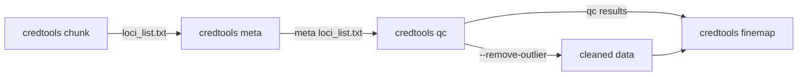

# Quality Control

The `credtools qc` command performs per-locus quality control on summary statistics and LD matrices to detect outlier SNPs, allele mismatches, and LD inconsistencies before fine-mapping.

## Overview

Quality control in credtools validates the consistency between z-scores and LD matrices using statistical methods derived from the SuSiE RSS framework. The QC process:

- **Estimates the lambda-s parameter** to quantify the consistency between z-scores and the LD matrix
- **Detects LD mismatch outliers** via Kriging RSS conditional expectation analysis
- **Identifies outlier SNPs** using the Dentist-S test statistic
- **Compares allele frequencies** between summary statistics and the LD reference panel
- **Optionally removes outliers** and re-runs QC on cleaned data
- **Generates per-locus and global summaries** for downstream review

!!! note "Why run QC?"
    Fine-mapping methods assume consistency between z-scores and the LD matrix. Violations (strand flips, allele coding errors, population mismatch, imputation artefacts) can produce spurious credible sets. Running QC catches these issues before they propagate.

## Quick Start

=== "Basic QC"

    ```bash
    credtools qc meta/meta_all/loci_list.txt qc_output/
    ```

=== "Multi-threaded"

    ```bash
    credtools qc meta/meta_all/loci_list.txt qc_output/ --threads 8
    ```

=== "With Outlier Removal"

    ```bash
    credtools qc meta/meta_all/loci_list.txt qc_output/ \
      --threads 8 \
      --remove-outlier
    ```

### Try It with Test Data

credtools ships with example locus files (`exampledata/`) that you can use to test QC directly via the Python API:

```python
from credtools.sumstats import load_sumstats
from credtools.ldmatrix import load_ld
from credtools.locus import Locus, LocusSet
from credtools.qc import locus_qc, locus_qc_summary

# Load two cohorts from exampledata
cohorts = [
    ("EUR", "UKB", "exampledata/EUR_loci1"),
    ("AFR", "MVP", "exampledata/AFR_loci1"),
]
loci = []
for popu, cohort, prefix in cohorts:
    ss = load_sumstats(f"{prefix}.sumstats", if_sort_alleles=True)
    ld = load_ld(f"{prefix}.ld.gz", f"{prefix}.ldmap", if_sort_alleles=True)
    lo = Locus(popu, cohort, 10000, ss,
               int(ss["BP"].min()), int(ss["BP"].max()), ld=ld)
    loci.append(lo)

ls = LocusSet(loci)

# Run QC
qc = locus_qc(ls, out_dir="/tmp/qc_example_output")
summary = locus_qc_summary(qc)
print(summary[["popu", "cohort", "n_snps", "lambda_s",
               "n_lambda_s_outlier", "n_dentist_s_outlier"]])
```

For the full CLI workflow, run the pipeline first to generate prepared loci:

```bash
credtools munge \
  "exampledata/test_mock_data/EUR_all_loci.sumstats,exampledata/test_mock_data/AFR_all_loci.sumstats,exampledata/test_mock_data/EAS_all_loci.sumstats" \
  /tmp/munge_output/ --force

credtools chunk /tmp/munge_output/sumstat_info_updated.txt /tmp/chunk_output/

credtools meta /tmp/chunk_output/loci_list.txt /tmp/meta_output/

# Run QC on meta-analysis results
credtools qc /tmp/meta_output/meta_all/loci_list.txt /tmp/qc_output/ --threads 2
```

## Command Reference

```
credtools qc [OPTIONS] INPUTS OUTDIR
```

**Arguments:**

| Argument | Description |
|----------|-------------|
| `INPUTS` | Tab-separated locus list file (e.g. from `credtools meta` or `credtools chunk`) |
| `OUTDIR` | Output directory for QC results |

**Options:**

| Option | Short | Description | Default |
|--------|-------|-------------|---------|
| `--threads` | `-t` | Number of parallel threads | `1` |
| `--remove-outlier` | | Remove outliers and re-run QC on cleaned data | `False` |
| `--logLR-threshold` | | Log-likelihood ratio threshold for LD mismatch detection | `2.0` |
| `--z-threshold` | | Z-score threshold for LD mismatch and marginal SNP detection | `2.0` |
| `--z-std-diff-threshold` | | Standardised z-difference threshold for marginal SNP outlier detection | `3.0` |
| `--r-threshold` | | Correlation threshold with lead SNP for marginal SNP detection | `0.8` |
| `--dentist-pvalue-threshold` | | −log10 p-value threshold for Dentist-S outlier detection | `4.0` |
| `--dentist-r2-threshold` | | r² threshold for Dentist-S outlier detection | `0.6` |
| `--log-file` | `-l` | Write log output to a file | `None` |

## QC Methods

### Kriging RSS (Lambda-s)

The Kriging RSS method estimates the parameter **lambda-s** (also called *s*), which quantifies the consistency between observed z-scores and the LD matrix under the SuSiE RSS null model:

$$z \mid R, s \sim \mathcal{N}(0, (1-s)R + sI)$$

A larger *s* indicates stronger inconsistency. For each SNP, the conditional mean and variance are computed, yielding:

- **z_std_diff**: standardised difference between observed and expected z-score
- **logLR**: log-likelihood ratio for allele switch detection

### Dentist-S

The [Dentist-S](https://github.com/mkanai/slalom) statistic tests each variant against the lead SNP:

$$t_{\text{dentist}} = \frac{(z_j - r_{jk} \cdot z_k)^2}{1 - r_{jk}^2}$$

Under the null, $t_{\text{dentist}} \sim \chi^2(1)$.

### MAF Comparison

When the LD reference panel includes allele frequencies (`AF2` column), credtools compares minor allele frequencies between the summary statistics and the reference. Large discrepancies may indicate population mismatch or allele coding issues.

### Lambda-s Interpretation

| Lambda-s | Interpretation |
|----------|---------------|
| < 0.1 | Good consistency between z-scores and LD |
| 0.1 – 0.3 | Moderate inconsistency — review flagged SNPs |
| > 0.3 | Strong inconsistency — consider re-imputation or LD panel swap |

### Outlier Detection Criteria

A SNP is flagged as an outlier if it satisfies **any** of the following three criteria:

| Criterion | Condition | Description |
|-----------|-----------|-------------|
| **C1 — LD mismatch** | `logLR > 2` AND `|z| > 2` | Significant SNPs whose observed effect is inconsistent with the LD structure. A high logLR indicates the observed z-score is unlikely under the LD model, and the `|z| > 2` filter ensures only SNPs with real signal are flagged (avoiding noise). |
| **C2 — Marginal SNP** | `|z| < 2` AND `|z_std_diff| > 3` AND `|r_lead| > 0.8` | Non-significant SNPs that are highly correlated with the lead SNP but show large deviations from expectation. If a SNP is in strong LD with the lead SNP (`r > 0.8`) yet carries little signal (`|z| < 2`) while its standardised residual is extreme (`|z_std_diff| > 3`), it likely reflects data quality issues rather than biology. |
| **C3 — Dentist-S** | `−log10(p_dentist) ≥ 4` AND `r² ≥ 0.6` | SNPs in moderate-to-high LD with the lead SNP that show significant discrepancy in the Dentist-S test. This catches variants whose z-scores are inconsistent with the lead SNP's z-score given their LD correlation. |

The thresholds in the table above are the defaults. Each can be adjusted via CLI options:

| Threshold | CLI Option | Default | Used in |
|-----------|-----------|---------|---------|
| logLR | `--logLR-threshold` | `2.0` | C1 |
| \|z\| | `--z-threshold` | `2.0` | C1 (upper bound), C2 (lower bound) |
| \|z_std_diff\| | `--z-std-diff-threshold` | `3.0` | C2 |
| \|r_lead\| | `--r-threshold` | `0.8` | C2 |
| −log10(p) | `--dentist-pvalue-threshold` | `4.0` | C3 |
| r² | `--dentist-r2-threshold` | `0.6` | C3 |

!!! note "z-threshold plays a dual role"
    The `--z-threshold` parameter serves as a boundary between C1 and C2: SNPs with `|z| > threshold` are evaluated for LD mismatch (C1), while SNPs with `|z| < threshold` are evaluated as marginal outliers (C2). This ensures every SNP is checked by the appropriate criterion based on its signal strength.

### Outlier Removal

The `--remove-outlier` flag triggers automatic outlier removal: SNPs flagged by any of C1, C2, or C3 are removed, and QC is re-run on the cleaned data. Both the original and cleaned summaries are saved for comparison.

## Output Format

### Directory Structure

```
qc_output/
├── qc.txt.gz                           # Global QC summary across all loci
├── qc_run_summary.log                   # Run metadata (timing, errors)
├── chr1_1000_50000/                     # Per-locus directory
│   ├── expected_z.txt.gz               # Kriging RSS results
│   ├── dentist_s.txt.gz                # Dentist-S results
│   ├── compare_maf.txt.gz             # MAF comparison
│   └── qc.txt.gz                       # Locus-level QC summary
└── cleaned/                             # Only with --remove-outlier
    ├── qc_cleaned.txt.gz               # Global cleaned QC summary
    ├── outlier_removal_summary.txt.gz  # Outlier removal statistics
    ├── cleaned_loci_info.txt.gz        # Loci info for cleaned data
    └── chr1_1000_50000/                # Per-locus cleaned files
        ├── EUR_UKB.sumstats.gz
        ├── EUR_UKB.ld.npz
        ├── EUR_UKB.ldmap.gz
        ├── expected_z.txt.gz
        ├── dentist_s.txt.gz
        ├── compare_maf.txt.gz
        └── qc.txt.gz
```

### Output Columns

**`expected_z.txt.gz`** — Kriging RSS results

| Column | Description |
|--------|-------------|
| `SNPID` | SNP identifier |
| `z` | Transformed z-score |
| `condmean` | Conditional mean from Kriging |
| `condvar` | Conditional variance |
| `z_std_diff` | Standardised difference (z − condmean) / sqrt(condvar) |
| `logLR` | Log-likelihood ratio for allele switch detection |
| `lambda_s` | Estimated lambda-s parameter |
| `cohort` | Cohort identifier (popu_cohort) |

**`dentist_s.txt.gz`** — Dentist-S results

| Column | Description |
|--------|-------------|
| `SNPID` | SNP identifier |
| `t_dentist_s` | Dentist-S test statistic (NaN for lead SNP) |
| `-log10p_dentist_s` | −log10 p-value |
| `r2` | r² with lead SNP |
| `cohort` | Cohort identifier |

**`compare_maf.txt.gz`** — MAF comparison

| Column | Description |
|--------|-------------|
| `SNPID` | SNP identifier |
| `MAF_sumstats` | MAF from summary statistics |
| `MAF_ld` | MAF from LD reference panel |
| `cohort` | Cohort identifier |

**`qc.txt.gz`** — Per-locus / global summary

| Column | Description |
|--------|-------------|
| `locus_id` | Locus identifier (global file only) |
| `popu` | Population |
| `cohort` | Cohort |
| `n_snps` | Number of SNPs |
| `n_1e-5` | SNPs with p < 1e-5 |
| `n_5e-8` | SNPs with p < 5e-8 |
| `maf_corr` | Pearson correlation between sumstats and LD MAFs |
| `lambda_s` | Estimated lambda-s parameter |
| `n_lambda_s_outlier` | Number of Kriging RSS outliers |
| `n_dentist_s_outlier` | Number of Dentist-S outliers |

## Integration with Pipeline



```bash
# Full pipeline
credtools munge population_config.txt munged/
credtools chunk munged/sumstat_info_updated.txt chunked/
credtools meta chunked/loci_list.txt meta/ --meta-method meta_all
credtools qc meta/meta_all/loci_list.txt qc/ --threads 8
credtools finemap meta/meta_all/loci_list.txt finemap_results/

# With outlier removal
credtools qc meta/meta_all/loci_list.txt qc/ --threads 8 --remove-outlier
credtools finemap qc/cleaned/cleaned_loci_info.txt.gz finemap_results/
```

!!! info "Heterogeneity metrics"
    Cross-cohort heterogeneity metrics (Cochran-Q, SNP missingness, LD 4th moment, LD decay) are computed **before** meta-analysis by `credtools meta` and saved in each locus's `heterogeneity/` directory. They are no longer part of the `credtools qc` output.

## Troubleshooting

??? question "High lambda-s values across many loci"
    This usually indicates a systematic mismatch between your summary statistics and the LD reference panel. Common causes:

    - Different genome builds (e.g. hg19 vs hg38)
    - LD reference from a different population
    - Allele flipping not properly handled during munging

    Try re-running `credtools munge` with careful column mapping, or use an LD reference that matches your GWAS population.

??? question "Too many Dentist-S outliers"
    Dentist-S flags SNPs whose z-scores are inconsistent with the lead SNP's z-score given their LD. Common causes:

    - Poor imputation quality at the locus
    - LD reference with insufficient sample size
    - Multiple independent signals at the locus (expected behaviour)

    Consider adjusting `--dentist-pvalue-threshold` (increase to be less strict) or `--dentist-r2-threshold`.

??? question "MAF comparison shows low correlation"
    A low MAF correlation between summary statistics and LD reference may indicate:

    - Population mismatch between GWAS and reference panel
    - Different allele frequency definitions (EAF vs MAF)
    - Allele flipping not resolved during data preparation

??? question "Memory issues with large loci"
    Large loci (>5000 SNPs) require significant memory for eigendecomposition. Solutions:

    - Reduce thread count to lower peak memory
    - Chunk large loci into smaller regions
    - Use `dtype=np.float32` in the API (not available via CLI)

??? question "QC run fails for some loci"
    Check `qc_run_summary.log` in the output directory for error details. Common causes:

    - Singular LD matrices (all eigenvalues near zero)
    - Loci with very few SNPs (<5)
    - Corrupted input files

    Failed loci are logged but do not block processing of other loci.

## Best Practices

!!! tip "Recommendations"
    1. **Always run QC after meta-analysis** — meta-analysis can introduce or amplify inconsistencies
    2. **Review lambda-s values** — they provide a quick overall quality indicator per cohort
    3. **Use `--remove-outlier` cautiously** — inspect outlier removal summaries to ensure genuine outliers (not true signals) are being removed
    4. **Start with default thresholds** — the defaults are calibrated for typical GWAS data; adjust only after reviewing results
    5. **Check the run summary log** — `qc_run_summary.log` reports timing, success/failure counts, and error details
    6. **Use parallel processing** — QC is embarrassingly parallel across loci; use `--threads` matching your available cores
